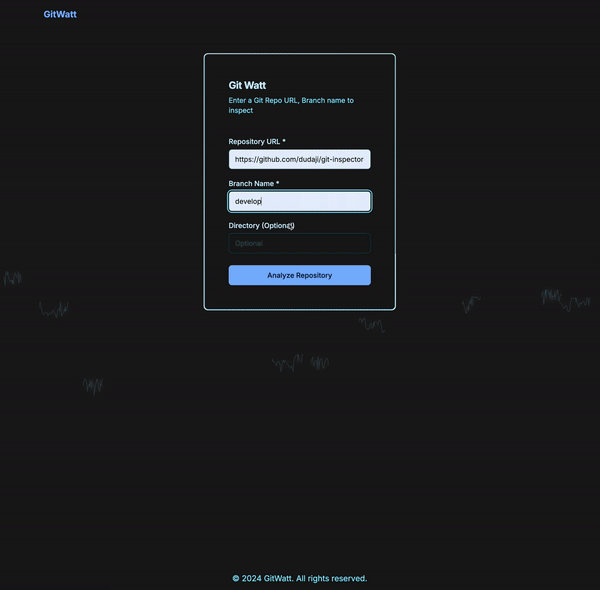
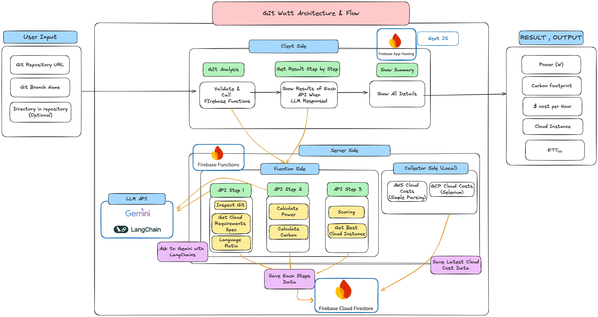

# GitWatt

Input git repository and get real-world costs!

Project  [GeminiAPI developer competiton](https://ai.google.dev/competition?hl=ko)

## YouTube Demo

## Architecture

### Made by

* DongHyun Youn : https://github.com/kade93
* Woosung Chung : https://github.com/Chungws
* Jaewon Roh : https://github.com/rjwharry